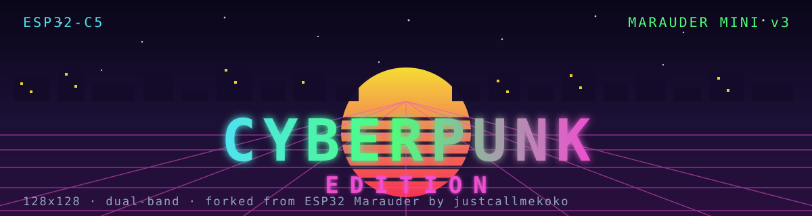

<div align="center">



<br>

<a href="https://cgarey2014.github.io/marauder-cyberpunk-edition/web-flasher/" target="_blank" rel="noopener">

</a>

### A neon retheme and 128 px text-fitting rebuild of **ESP32 Marauder**, for the Marauder Mini v3.

[](https://github.com/justcallmekoko/ESP32Marauder)
[](#what-this-is)
[](#what-changed)
[](LICENSE)

</div>

---

## Flash it

**<a href="https://cgarey2014.github.io/marauder-cyberpunk-edition/web-flasher/" target="_blank" rel="noopener">Open the web flasher</a>** — in Chrome or Edge, plug the board in over USB-C, and pick the port. Nothing to install: no toolchain, no drivers, no command line. The page talks to the board over USB.

- **Application update** — replaces the app only. **Keeps your settings**, saved WiFi, and Evil Portal templates. Use this one.
- **Full install (factory image)** — writes the whole 8 MB flash. For a blank or unknown board; wipes settings.

**The flash layout is byte-identical to the official v1.17.0 Mini v3 release** — same bootloader, same partition table, same OTA data — so the [official JCMK installer](https://justcallmekoko.github.io/MarauderInstaller/) remains a valid recovery path at any time.


## What this is

A personal build of [justcallmekoko's ESP32 Marauder](https://github.com/justcallmekoko/ESP32Marauder) for **one board**: the **Marauder Mini v3**, the ESP32-C5 generation with a 128 × 128 ST7735 panel.

It exists because the stock firmware targets that panel without quite fitting it — long values were clipped mid-string, and the interface is monochrome enough that a screen of data is hard to read at a glance. This build fixes the fitting, gives the UI a neon cyberpunk palette derived from a reference image, and makes color mean something.

**Everything that makes the Marauder work is upstream's.** The WiFi and Bluetooth tooling, the CLI, the wardriving upload, the Evil Portal, the GPS stack, the drivers — none of that is mine. See [Attribution](#attribution). What is different is listed below, in full, and the changes are also in [`patches/`](patches/) as a diff against upstream v1.17.0.

## Fixes to upstream code

These are defects in upstream's handling of this panel. Each one is a change to the original code, and each is listed with its cause so it can be checked against the [patch](patches/cyberpunk-edition.patch).

| symptom on the device | cause in the original code | fix |
|---|---|---|
| MAC addresses, BSSIDs, IP addresses, hardware names cut off mid-string | a 128 px panel shows **21 characters** per row, and the original printer drew every line as a single row — anything longer was simply clipped | new `Display::printWrapped()` continues a long line on the rows below, leaving the cursor where a plain `println()` would, so surrounding layout is untouched |
| screen titles losing their tail (`SSID Beacon Clone`, `Bluetooth Analyzer`) | titles drawn in the large font (8 px per glyph) — 16 characters fit across 128 px | titles fall back to the small font when the large one would overrun the panel |
| the Follow / device list showing `DD:EE:FF Tx: 12 4s` | the mini-screen branch deliberately printed only `mac_str.substring(mac_str.length() / 2)` — the **second half** of the MAC | the whole MAC is printed, wrapping if needed |
| GPS **date/time and UTC stamps** cut off | the D/T and UTC strings are 23–24 characters — the longest lines on those screens — and went through single-line prints | every GPS data line wraps, and `test_gps_layout` asserts the row budget so a field added later fails a test instead of vanishing |
| raw **NMEA sentences** cut at 21 characters | `GPS_NMEA_SCRNWRAP` is `false` for the Mini targets, so 60–80 character sentences were clipped — even though that screen's row accounting was written to expect wrapped ones | wrapping enabled for the Mini v3 (`MARAUDER_MINI` left exactly as upstream had it) |
| GPS indicator in the status bar blank with no module attached | upstream draws it only when a module is detected, and shows red for "no fix" — so *absent* and *searching* looked identical | always drawn, in three states: red = no module, amber = no fix yet, green = fix |
| `SD` label could be drawn in an undefined color | `updateStatusBar()` reads `the_color` on the screen path without it having been assigned when `HAS_SD` is undefined | variable initialised, and the SD label only drawn where `HAS_SD` exists |

## What this build adds on top

Not fixes — additions. Marked separately so nothing is misattributed to upstream:

- **The neon palette and color scheme.** Menus color by what an item *is* — tags one color, Bluetooth another, passive monitors another — with a floor of 35° of hue between any two colors used in the same menu, so no submenu reads as one flat color. The attack menus are grouped by mechanism: beacon/frame spam, floods and disruption, rogue-AP and social attacks, and (on the Bluetooth side) Apple pop-up spam and tag attacks. Data screens dim the field name and color the value by its kind.
- **The boot splash.** A synthwave sunset with the CYBERPUNK EDITION wordmark, drawn from a table of horizontal runs (~1.7 KB) rather than a pixel buffer (~18 KB).

### Screen brightness

**Device → Brightness.** Up/right brightens, down/left dims, and the centre button saves and returns. The change applies to the backlight as you move, so you can see the level you are choosing, and it is written to NVS only on save, so it survives a reboot.

Upstream has this setting and a PWM backlight path, but **both are behind `#ifndef HAS_MINI_SCREEN`**, because its brightness screen is touch-driven — "tap the top to brighten" — and this board has no touch panel at all. This is the same feature rebuilt for the 5-way tactile switch:

- the PWM/LEDC path now covers the Mini v3 as well as the full-screen targets; the other mini screens keep their plain on/off fallback, having no dimmable backlight pin
- the Mini v3 backlight is **active low**, so the PWM duty is inverted — otherwise every level would run backwards
- the level table, the LEDC API differences and that inversion live in one place, guarded so no other board's behaviour changes

### The palette, and the two rules behind it

Both rules are enforced by the generator (`tools/generate_neon_palette.py`) rather than by eye, because both were learned the hard way:

1. **Every color must be readable as text.** The firmware hands these colors to *menu labels*, so each one is drawn color-on-black when unselected and black-on-color when selected — which means a single contrast floor covers both. A color that looked like a harmless dark fill turned out to be the text color for a menu, and shipped invisible.
2. **Saturated colors must be far apart in hue.** Two entries ten degrees apart read as one color on a small panel. Nothing in the palette is within 30° of anything else.

| role | color | contrast on black |
|---|---|---|
| body / menu text | `#EAF7FF` | 19.4:1 |
| accent — scanners, WiFi | `#4FE3EE` | 13.5:1 |
| success — WiFi frames, GPS | `#4DFF7A` | 15.9:1 |
| warning — files, SD, uploads | `#FF8C55` | 9.2:1 |
| attacks, errors | `#FF3355` | 5.8:1 |
| highlights, recon | `#ED4FD0` | 6.7:1 |
| attention, choices | `#FFE633` | 16.7:1 |
| info, wardriving | `#7FA8FF` | 9.0:1 |
| fox hunt, geofences | `#A6F53C` | 16.0:1 |
| Bluetooth | `#B071F0` | 6.7:1 |
| configuration | `#CFDCEE` | 15.4:1 |
| Back / exit rows | `#B4C1D8` | 11.8:1 |

## Build it

Requires `arduino-cli` with the `esp32:esp32@3.3.4` core, and Rosetta 2 on Apple silicon (the bundled `ctags` is x86_64-only; substituting a native one corrupts `.ino` prototype generation).

```bash
tools/build_mini_v3.sh              # writes ../miniv3-build/out
python3 tools/package_mini_v3_flasher.py --build-dir ../miniv3-build/out
~/myrepos/espvenv/bin/pio test -e native    # 127 host tests
```

The host tests cover the text-fitting helpers, the palette rules, the GPS screen row budget, and the splash layout — the things that are easy to get wrong and invisible until they are on a device.

Reverting is as easy as not using it: every change is confined to the `MARAUDER_MINI_V3` target or gated behind a macro that expands to the upstream value elsewhere, so other boards build and behave exactly as upstream does.

## Attribution

This is a derivative work. It would not exist without:

- **[ESP32 Marauder](https://github.com/justcallmekoko/ESP32Marauder)** by **[justcallmekoko](https://github.com/justcallmekoko)** — the firmware, drivers, CLI, and every tool in it. MIT licensed; the original copyright notice is preserved in [`LICENSE`](LICENSE).
- **Marauder Mini v3** hardware, also by justcallmekoko / JCMK LLC. Not affiliated with, endorsed by, or supported by him. **Do not report problems with this build upstream.**
- The **neon palette** is derived from a color reference image supplied by the device owner. No third-party artwork is redistributed here; the SVG header and the palette are original to this repo.

Modifications copyright © 2026 [cgarey2014](https://github.com/cgarey2014), released under the same MIT terms.

## Disclaimer

ESP32 Marauder is an **offensive security tool**. Deauthentication, beacon spam, handshake capture and the like are illegal to use against networks you do not own or lack written permission to test. Laws vary by country and by state.

This repository is a **UI fork** — it changes how the firmware looks and fits, not what it does. Nothing here adds capability. Use it on your own hardware and your own networks, or in a lab you are authorised to test.

The authors and contributors accept no liability for misuse or for any damage arising from it.
